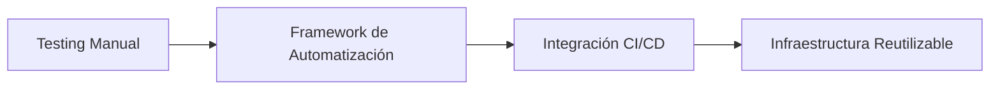
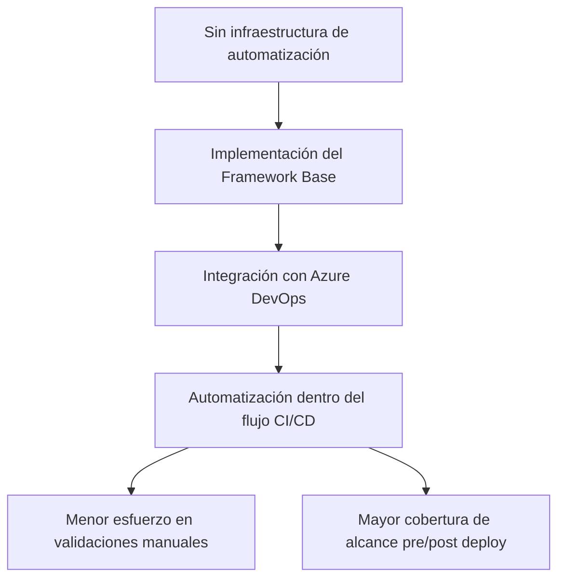
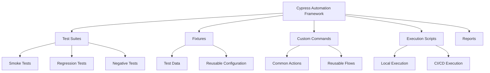
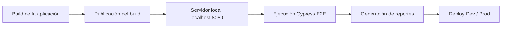
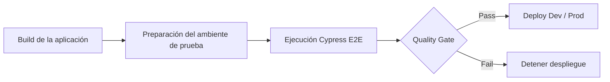
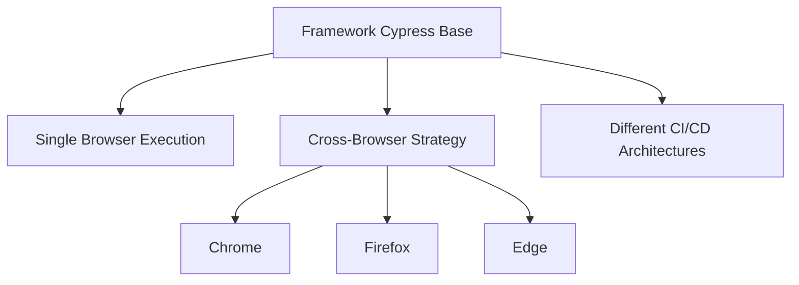

> ### Confidentiality Notice
> This repository contains an anonymized portfolio case study based on a real-world project.
> 
> Company names, client information, URLs, credentials, proprietary business logic, and sensitive implementation details have been removed or modified to protect confidentiality.
> 
> Any code snippets included are examples only and do not represent any protected production codebase.

---

# Automation Framework & CI/CD Integration

## Índice

- [Contexto del Proyecto](#contexto-del-proyecto)
- [Objetivo del Proyecto](#objetivo-del-proyecto)
- [Decisiones de Diseño](#decisiones-de-diseño)
- [Arquitectura del Framework](#arquitectura-del-framework)
- [Integración CI/CD con Azure DevOps](#integración-cicd-con-azure-devops)
- [Reporting y Evidencia de Ejecución](#reporting-y-evidencia-de-ejecución)
- [Mantenimiento y Evolución del Framework](#mantenimiento-y-evolución-del-framework)
- [Escalabilidad y Extensiones Futuras](#escalabilidad-y-extensiones-futuras)
- [Conclusión y Resultados](#conclusión-y-resultados)
- [Capacidades Demostradas](#capacidades-demostradas)

## Resumen del Proyecto

Este proyecto documenta la implementación del framework base de automatización para aplicaciones web utilizando Cypress, así como su integración al flujo de Integración Continua y Despliegue Continuo (CI/CD) mediante Azure DevOps.
Este framework fue integrado dentro de Azure DevOps, incorporando la ejecución de pruebas Cypress como un quality gate previo al despliegue, lo que permite validar la estabilidad funcional de la aplicación antes de avanzar hacia ambientes posteriores, evitando que cambios con regresiones conocidas continúen dentro del proceso de entrega.

Este repositorio documenta:

- La implementación del framework base de automatización con Cypress.
- Las principales decisiones de diseño y arquitectura.
- La integración del framework al flujo CI/CD mediante Azure DevOps.
- Los estándares definidos para una integración reutilizable y mantenible.
- Estrategias de escalabilidad para futuras implementaciones.

| Elemento | Descripción |
|----------|-------------|
| **Rol** | QA Engineer |
| **Responsabilidad principal** | Implementación del framework base de automatización e integración CI/CD |
| **Tecnologías** | Cypress, JavaScript, Azure DevOps, YAML Pipelines, GitHub, Mochawesome |
| **Resultado** | Infraestructura reutilizable para automatización en aplicaciones web |

---



---

## Contexto del Proyecto

Al iniciar este proyecto no existía una infraestructura de automatización para las aplicaciones web de la organización. Las actividades de QA se realizaban principalmente mediante pruebas manuales sin un framework de automatización integrado al flujo de CI/CD.

Como parte de esta iniciativa, se implementó el framework base de automatización utilizando Cypress, definiendo la estructura inicial del proyecto, la organización de suites de prueba, comandos reutilizables, fixtures, scripts de ejecución y la estrategia de integración con Azure DevOps.

El objetivo fue establecer una base técnica reutilizable que permitiera incorporar pruebas automatizadas dentro de los pipelines existentes, facilitando su mantenimiento, escalabilidad y futura adopción en nuevos proyectos.



## Objetivo del Proyecto

Diseñar e implementar una infraestructura base de automatización que permitiera integrar pruebas E2E con Cypress al flujo de CI/CD existente mediante Azure DevOps, definiendo una arquitectura reutilizable para futuros proyectos.

Como parte de esta implementación también se establecieron estándares para la organización del framework, la administración de datos de prueba, la reutilización de componentes, la configuración del pipeline y la generación automática de evidencia de ejecución.

| Objetivo | Implementación |
|----------|----------------|
| Framework de automatización | Cypress + JavaScript |
| Integración continua | Azure DevOps YAML |
| Organización del proyecto | Suites, Fixtures y Commands |
| Evidencia automática | Mochawesome + Artifacts |
| Control de Versiones | GitHub |
| Escalabilidad | Arquitectura reutilizable |

---

## Decisiones de Diseño

La implementación del framework de automatización requirió definir una estructura que permitiera mantener las pruebas organizadas, reutilizables y preparadas para integrarse dentro de procesos CI/CD.

Las siguientes decisiones fueron tomadas considerando mantenibilidad, escalabilidad y facilidad de adopción por parte de equipos de QA y desarrollo.

| Decisión | Implementación | Beneficio |
|----------|----------------|----------|
| Framework de automatización | Cypress | Permite una implementación rápida de pruebas E2E, con una sintaxis clara y capacidades integradas para ejecución, validación e interacción con aplicaciones web. |
| Organización de pruebas | Separación por suites (Smoke, Regression, Negative) | Facilita la ejecución selectiva de escenarios según el objetivo de validación. |
| Manejo de datos | Fixtures | Centraliza información reutilizable, facilita ejecuciones locales y simplifica procesos de debugging durante el desarrollo de pruebas. |
| Componentes reutilizables | Custom Commands | Reduce repetición de código y facilita el mantenimiento de acciones comunes. |
| Configuración CI/CD | Variables gestionadas desde Azure DevOps | Permite manejar información sensible sin exponer credenciales o configuraciones dentro del código. |
| Evidencia de ejecución | Mochawesome + Azure Artifacts | Genera reportes automáticos y facilita el análisis posterior de resultados. |


---

## Arquitectura del Framework

La estructura del framework fue diseñada con el objetivo de separar responsabilidades, facilitar el mantenimiento de las pruebas y permitir la incorporación de nuevos escenarios sin duplicar lógica existente.

La organización contempla una separación entre escenarios de prueba, datos reutilizables, comandos personalizados y configuraciones necesarias para la ejecución automatizada.



```text
automated-tests/
│
├── cypress/
│   ├── e2e/
│   │   ├── 1-smoke/
│   │   ├── 2-negative/
│   │   └── 3-regression/
│   │
│   ├── fixtures/
│   │
│   ├── support/
│   │   └── commands.js
│   │
│   └── reports/
│
├── package.json 
└── cypress.config.js
```
La estructura permite mantener separadas las responsabilidades del framework:

- `e2e`: contiene los escenarios automatizados organizados por objetivo de validación.
- `fixtures`: almacena datos reutilizables utilizados durante las ejecuciones locales y desarrollo de pruebas.
- `support`: concentra comandos reutilizables y lógica común para evitar duplicación.
- `reports`: almacena evidencias generadas durante la ejecución automatizada.
- `package.json`: centraliza los scripts necesarios para ejecución y mantenimiento del framework.

---

## Integración CI/CD con Azure DevOps

El framework de automatización fue integrado dentro del flujo CI/CD existente mediante pipelines YAML de Azure DevOps, incorporando la ejecución de pruebas Cypress como un quality gate previo al despliegue.

Esta integración permite validar la estabilidad funcional de la aplicación antes de avanzar hacia ambientes posteriores, evitando que cambios con regresiones conocidas continúen dentro del proceso de entrega.


## Integración CI/CD con Azure DevOps

**Tabla de componentes del pipeline**

| Componente | Función |
|------------|---------|
| Azure DevOps YAML | Define la configuración y ejecución del pipeline |
| Build Stage | Genera el artefacto de la aplicación |
| Cypress Stage | Ejecuta pruebas automatizadas E2E |
| Pipeline Variables | Gestiona configuración externa y datos sensibles |
| Mochawesome | Genera reportes HTML y JSON |
| Artifacts | Publica evidencias de ejecución |


### Configuración de variables para ejecución Cypress

Las variables requeridas por las pruebas son administradas desde Azure DevOps y exportadas durante la ejecución del job de Cypress.

```yaml
export CYPRESS_BASE_URL=http://localhost:8080
export CYPRESS_USER=$(CYPRESS_USER)
export CYPRESS_PASSWORD=$(CYPRESS_PASSWORD)
export CYPRESS_API_URL=$(CYPRESS_API_URL)
```


La integración actual utiliza una arquitectura:

Build → Test → Deploy

Donde Cypress valida la aplicación antes de permitir la siguiente fase del proceso.

→ El pipeline determina el ambiente de despliegue según la rama destino: `dev` para Development y `main` para Production.


---

## Reporting y Evidencia de Ejecución

Como parte de la integración, se implementó la generación automática de evidencia posterior a la ejecución de pruebas mediante Mochawesome.

Los resultados de Cypress son transformados en reportes HTML y JSON, permitiendo consultar el detalle de las ejecuciones, identificar fallos y mantener trazabilidad del proceso de validación dentro del pipeline.

Los artifacts de ejecución son publicados independientemente del resultado de las pruebas mediante condiciones de ejecución controladas, asegurando la disponibilidad de evidencia para análisis posterior.

```yaml
condition: succeededOrFailed()
```

| Componente | Función |
|------------|---------|
| Cypress | Ejecución de escenarios automatizados E2E |
| Mochawesome | Generación de reportes HTML y JSON |
| Azure DevOps Artifacts | Almacenamiento de evidencias generadas |

### Configuración de reporter

```bash
npx cypress run \
--reporter mochawesome \
--reporter-options "html=true,json=true"
```


## Mantenimiento y Evolución del Framework

La arquitectura implementada fue diseñada considerando mantenibilidad y crecimiento futuro, permitiendo incorporar nuevos escenarios de prueba, reutilizar componentes existentes y adaptar la ejecución según las necesidades del proyecto.

La separación de suites, comandos reutilizables y configuración integrada facilita la evolución del framework sin requerir modificaciones estructurales en la base existente.


## Escalabilidad y Extensiones Futuras

Además de la configuración base implementada, se documentaron estrategias para extender la infraestructura de automatización hacia escenarios de mayor cobertura y complejidad.

Estas alternativas permiten reutilizar la misma base de pruebas y adaptarla a diferentes arquitecturas CI/CD sin modificar la lógica principal de los escenarios automatizados.


| Estrategia | Descripción | Beneficio |
|------------|-------------|----------|
| Ejecución Cross-Browser | Uso de matrices de Azure DevOps para ejecutar suites Cypress en diferentes navegadores. | Incrementar cobertura de validación. |
| Reportes por navegador | Generación de artifacts independientes por ejecución. | Facilitar análisis aislado de resultados. |
| Ambientes desplegados | Ejecución de pruebas contra ambientes previamente publicados. | Permitir validaciones más avanzadas posteriores al deployment. |
| Reutilización de suites | Mantener la misma base de automatización entre diferentes flujos CI/CD. | Reducir duplicación y esfuerzo de mantenimiento. |




```YAML
strategy:
  matrix:
    chromeRun:
      browser: chrome
    firefoxRun:
      browser: firefox
    edgeRun:
      browser: edge
```
```txt
Framework Cypress
        │
        ▼
Configuración YAML Azure DevOps
        │
        ├── Matrices → Cross-Browser
        ├── Variables → Configuración externa
        ├── Artifacts → Evidencia
        ├── Jobs/Stages → Flujo de ejecución
        └── Condiciones → Control del pipeline
```
Estas estrategias fueron documentadas como extensiones de la arquitectura base, permitiendo adaptar la ejecución del framework mediante configuraciones YAML sin modificar los escenarios automatizados existentes.


## Conclusión y Resultados

La implementación permitió establecer la base de automatización para aplicaciones web mediante Cypress, integrando su ejecución dentro de un flujo CI/CD administrado con Azure DevOps.

El proyecto evolucionó desde un escenario sin infraestructura automatizada hacia una solución con estructura organizada de pruebas, componentes reutilizables, generación automática de evidencia y validaciones previas al despliegue.

La arquitectura implementada proporciona una base mantenible y escalable para incorporar nuevas suites automatizadas, extender estrategias de validación y adaptarse a futuras necesidades del ciclo de entrega.

## Capacidades Demostradas

- Diseño e implementación de frameworks base de automatización con Cypress + JavaScript.
- Organización de suites, fixtures y comandos reutilizables.
- Integración de pruebas automatizadas dentro de pipelines CI/CD.
- Configuración de ejecución mediante Azure DevOps YAML.
- Implementación de reportes automáticos y evidencia de ejecución.
- Diseño de arquitecturas orientadas a mantenimiento y escalabilidad.
