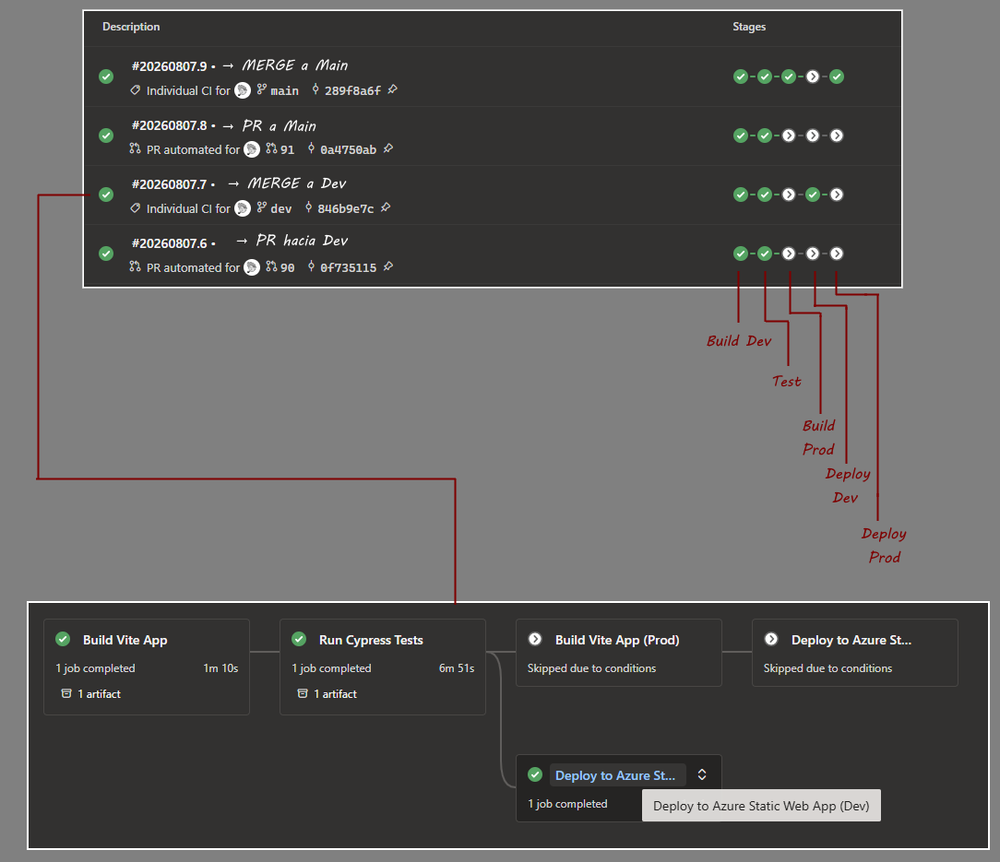
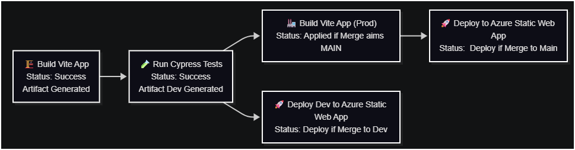

### Pipeline CI/CD (Vite + Cypress + Azure Static Web Apps)

Este framework de automatización fue integrado dentro del flujo CI/CD mediante pipelines YAML de Azure DevOps, incorporando la ejecución de pruebas Cypress E2E como un quality gate previo al despliegue.

Este archivo YAML define un flujo automatizado que construye tu aplicación, corre pruebas end‑to‑end con Cypress y despliega a Azure Static Web Apps dependiendo de la rama (dev o main).
</br>
La idea es que cada vez que alguien hace un push o merge, el sistema se encargue de todo sin intervención manual.

### 🧭 Resumen del flujo

El pipeline sigue esta lógica:

| Situación      | Build inicial | Cypress | Build PROD | Deploy |
| -------------- | ------------- | ------- | ---------- | ------ |
| PR → `dev`     | DEV           | DEV     | —          | —      |
| Merge → `dev`  | DEV           | DEV     | —          | DEV    |
| PR → `main`    | DEV           | DEV     | —          | —      |
| Merge → `main` | DEV           | DEV     | PROD       | PROD   |

**En palabras simples:**

- Siempre se construye la app en modo dev.
- Cypress ejecuta la validación E2E contra ese build generado.
- Los resultados de pruebas determinan si el proceso puede continuar:
  </br>
  - Solo si se hace merge a main:
    - Se construye la versión prod.
    - Se despliega a producción.
  - Solo si se hace merge a dev:
    - Se despliega a ambiente de desarrollo.



**¿Cuál es el impacto en calidad?**

- Con esto evitamos que si se encuentra un bug, éste llegue a producción.
- Se puede identificar rápidamente gracias a los reportes HTML.
- Corrobora que las plataformas estén limpias desde los Pull Requests.
- Previene deploys a Dev y a Main en estos casos.



### Fragmento que integra Cypress a Pipeline:

```yml
# =========================

# CYPRESS TESTS

# =========================

- stage: Test
  displayName: "Run Cypress Tests"
  dependsOn: Build
  condition: succeeded()

  jobs: - job: CypressTests
  displayName: "Execute Cypress E2E Tests"

        pool:
          vmImage: $(vmImageName)

        steps:
          - task: NodeTool@0
            inputs:
              versionSpec: "20.x"
            displayName: "Install Node.js"

          - download: current
            artifact: vite-dist

          - script: npm install -g serve wait-on
            displayName: "Install serve and wait-on"

          - script: serve -s $(Pipeline.Workspace)/vite-dist -l 8080 &
            displayName: "Start application on localhost:8080"

          - script: wait-on http://localhost:8080
            displayName: "Wait for application"

          - script: |
              cd automated-tests
              npm ci
              npm install mochawesome
              npm install -D cypress-iframe
            displayName: "Install Cypress dependencies"

          - script: |
              cd automated-tests
              export CYPRESS_VARIABLE =

              npx cypress run --reporter mochawesome --reporter-options "reportDir=cypress/reports,reportFilename=$(browser)Report,timestamp=mmddyyyy_HHMMss,overwrite=true,html=true,json=true"
            displayName: "Run Cypress Tests"
            continueOnError: true

          - publish: $(System.DefaultWorkingDirectory)/automated-tests/cypress/reports
            artifact: Report
            condition: succeededOrFailed()

          - publish: $(System.DefaultWorkingDirectory)/automated-tests/cypress/screenshots
            artifact: Screenshots
            condition: failed()

          - task: PublishTestResults@2
            condition: always()
            inputs:
              testResultsFormat: "JUnit"
              testResultsFiles: "automated-tests/results/*.xml"
              failTaskOnFailedTests: true

```

### 🏗️ 1. Etapa: Build (Construcción de la app)

Esta etapa prepara la aplicación para ser probada.

¿Qué hace?

1. Instala Node.js.
2. Instala dependencias (npm ci).
3. Construye la versión de desarrollo (npm run build:dev).
4. Publica la carpeta dist como artefacto llamado vite-dist.

**¿Por qué es importante?**

Este artefacto es la versión empaquetada de tu app. Cypress lo usará para correr las pruebas y, más adelante, se reutiliza para el despliegue en Dev.

### 🧪 2. Etapa: Test (Pruebas con Cypress)

Esta etapa corre las pruebas end‑to‑end para validar que la app funciona correctamente.

¿Qué hace?

1. Descarga el artefacto generado en el Build.
2. Levanta la aplicación localmente usando serve en el puerto 8080.
3. Espera a que la app esté lista.
4. Instala dependencias de Cypress.
5. Ejecuta las pruebas con reporter mochawesome.
6. Publica:
   - Reportes de pruebas.
   - Screenshots (solo si fallan).
   - Resultados JUnit.

**¿Por qué es importante?**

Permite detectar errores antes de desplegar. Si algo falla aquí, el pipeline puede detenerse o marcar la ejecución como fallida.

### 🏭 3. Etapa: BuildProd (Construcción para Producción)

Esta etapa solo ocurre cuando el código se integra a la rama main.

¿Qué hace?

1. Instala dependencias.
2. Construye la versión de producción (npm run build:prod).
3. Publica el artefacto vite-dist-prod.

**¿Por qué es importante?**

La versión de producción suele estar optimizada y minificada. Es la que realmente se despliega al ambiente productivo.

### 🚀 4. Etapa: DeployDev (Despliegue a ambiente de desarrollo)

Se ejecuta únicamente cuando hay un merge a la rama dev.

¿Qué hace?

1. Descarga el artefacto vite-dist.
2. Copia los archivos a app/dist.
3. Usa la tarea AzureStaticWebApp@0 para desplegar al ambiente development.

**¿Por qué es importante?**

Permite validar cambios en un entorno real antes de enviarlos a producción.

### 🚀 5. Etapa: DeployProd (Despliegue a producción)

Se ejecuta únicamente cuando hay un merge a main.

¿Qué hace?

1. Descarga el artefacto vite-dist-prod.
2. Copia los archivos a app/dist.
3. Despliega al ambiente production usando el token de producción.

**¿Por qué es importante?**

Es el paso final: tu aplicación queda disponible para usuarios reales.

<details>
<summary>

```js
⚙️ Snippet Código YAML para Builds [ Click ]
```

</summary>

<br>

```yml
trigger:
  - dev
  - main

variables:
  vmImageName: "ubuntu-latest"

stages:
  # =========================
  # BUILD (siempre genera dist)
  # =========================
  - stage: Build
    displayName: "Build Vite App"
    jobs:
      - job: BuildJob
        pool:
          vmImage: $(vmImageName)

        steps:
          - task: NodeTool@0
            inputs:
              versionSpec: "20.x"
            displayName: "Install Node.js"

          - script: npm ci
            displayName: "Install dependencies"

          - script: npm run build:dev
            displayName: "Build (dev)"
            #condition: ne(variables['Build.SourceBranch'], 'refs/heads/main')

          - script: |
              echo "Listing workspace after build:"
              ls -R .
            displayName: "Debug workspace"

          - publish: dist
            artifact: vite-dist
            displayName: "Publish dist artifact"

# =========================

# CYPRESS TESTS

# =========================

[...]


  # =========================
  # BUILD PROD
  # =========================
  - stage: BuildProd
    displayName: "Build Vite App (Prod)"
    dependsOn: Test
    condition: and(succeeded(), eq(variables['Build.SourceBranch'], 'refs/heads/main'))

    jobs:
      - job: BuildProdJob
        pool:
          vmImage: $(vmImageName)

        steps:
          - task: NodeTool@0
            inputs:
              versionSpec: "20.x"
            displayName: "Install Node.js"

          - script: npm ci
            displayName: "Install dependencies"

          - script: npm run build:prod
            displayName: "Build (prod)"

          - script: |
              echo "Listing workspace after build:"
              ls -R .
            displayName: "Debug workspace"

          - publish: dist
            artifact: vite-dist-prod
            displayName: "Publish prod artifact"

  # =========================
  # DEPLOY DEV
  # =========================
  - stage: DeployDev
    displayName: "Deploy to Azure Static Web App (Dev)"
    dependsOn: Test
    condition: and(succeeded(), eq(variables['Build.SourceBranchName'], 'dev'))

    jobs:
      - deployment: DeployDev
        environment: "development"

        strategy:
          runOnce:
            deploy:
              steps:
                - download: current
                  artifact: vite-dist

                - script: |
                    mkdir -p app/dist
                    mv $(Pipeline.Workspace)/vite-dist/* app/dist/
                    ls -la app/dist
                  displayName: "Move and list downloaded artifact contents"

                - task: AzureStaticWebApp@0
                  inputs:
                    app_location: "app/dist"
                    skip_app_build: true
                    skip_api_build: true
                    azure_static_web_apps_api_token: $(deployment_token)

  # =========================
  # DEPLOY PROD
  # =========================
  - stage: DeployProd
    displayName: "Deploy to Azure Static Web App (Prod)"
    dependsOn: BuildProd
    condition: and(succeeded(), eq(variables['Build.SourceBranchName'], 'main'))

    jobs:
      - deployment: DeployProd
        environment: "production"

        strategy:
          runOnce:
            deploy:
              steps:
                - download: current
                  artifact: vite-dist-prod

                - script: |
                    mkdir -p app/dist
                    mv $(Pipeline.Workspace)/vite-dist-prod/* app/dist/
                    ls -la app/dist
                  displayName: "Move and list downloaded artifact contents"

                - task: AzureStaticWebApp@0
                  inputs:
                    app_location: "app/dist"
                    skip_app_build: true
                    skip_api_build: true
                    azure_static_web_apps_api_token: $(deployment_token_prod)
```

</details>

### 📝 Conclusión

Este pipeline automatiza todo el ciclo:

1. Construcción
2. Pruebas
3. Construcción para producción
4. Despliegue según la rama

Con esto garantizas que cada cambio pase por pruebas y que solo lo que está en main llegue a producción después de ser validado por las pruebas E2E.

---

## Resultados de la Implementación

La integración permitió evolucionar desde una ejecución manual de pruebas hacia un proceso automatizado dentro del ciclo de entrega.

Resultados principales:

→ Implementación de ejecución Cypress como quality gate dentro del pipeline.

→ Separación entre validación DEV y generación de artefactos PROD.

→ Reducción de ejecuciones innecesarias mediante condiciones por branch.

→ Control automatizado del flujo Build → Test → Deploy.

→ Publicación automática de evidencia para análisis de resultados.

→ Arquitectura preparada para incorporar nuevas suites y estrategias de validación.

## Capacidades Demostradas

- Diseño para este caso e integración de pipelines CI/CD utilizando Azure DevOps YAML.
- Implementación de quality gates mediante pruebas automatizadas.
- Gestión de artefactos entre stages del pipeline.
- Configuración de variables externas para ejecución segura.
- Diseño de estrategias de despliegue basadas en ramas.
- Integración de automatización E2E dentro de procesos reales de entrega continua.


<div style="text-align:center; color:#888; font-size:10px;">
    QA Documentation | Axel Van Dyck | QA Engineer 
</div>
